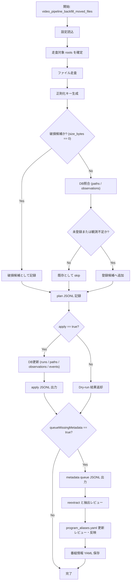

# video-library-pipeline 既存移動済みファイル DB登録 要件定義

## 1. 目的

既に移動済み（主に `destRoot` 配下、またはユーザー指定ルート配下）だが DB 未登録の動画ファイルを、既存 DB 契約を壊さずに登録する。  
重複判定・再抽出・監査の前提となる「DB網羅性」を担保する。

## 2. 背景課題

- 既存ユーザーは、プラグイン導入前に手動/別運用でファイルを移動済みの場合がある。
- `paths` / `observations` / `runs` に未反映があると、重複判定・再抽出判定が不正確になる。
- ドライブレター変更（例: `B:` -> `E:`）で、実体は同じでも DB パス不一致が発生する。

## 動作フロー（Mermaid）

## 3. 欲しい機能（反映済み）

1. ドライブ着脱やドライブレター変更に対応した再同期/再構築
2. 既存正則化処理と同一ロジックでのファイル名取り扱い
3. ユーザーによるファイルリネーム履歴の追跡
4. 破損ファイルの検知
5. `destRoot` 固定ではなく、ユーザー指定フォルダ群の走査
6. DB 未登録ファイルのメタデータ抽出キュー化（LLM抽出・YAML化フローにつなぐ）

## 4. スコープ

対象:

- `destRoot`（デフォルト）または `roots[]` で指定された任意フォルダを走査  **roots[]は人間にも読みやすい形のYAMLでWSL側に保存する**
- Dry-run で差分件数と候補を可視化
- apply で DB へ upsert（既存スキーマ互換）
- 監査ログ（JSONL）を出力
- `queueMissingMetadata=true` の場合、未登録分を抽出キューに追加

非対象:

- ファイル移動/削除/リネームそのもの
- 既存 `path_metadata` の強制上書き
- AI抽出処理本体（本要件ではキュー投入まで）

## 5. 前提・制約

- DB スキーマは既存互換（`mediaops_schema.py` 契約維持）
- `path_id` は既存ロジック（`ingest_inventory_jsonl.py` の UUIDv5 規則）を再利用
- パス比較は Windows 形式で正規化
- ファイル名正則化は既存 `normalize_filenames.ps1` と同一ポリシーで解釈
- 単一実行前提（同時多重実行は保証しない）

## 6. 機能要件

### FR-01 走査・未登録判定

- 対象拡張子デフォルトは `.mp4`（将来 `extensions[]` で拡張）
- 未登録判定（最低要件）:
1. `paths.path = <file path>` が存在しない
2. もしくは `paths` はあるが `observations` に最新実在情報が不足

### FR-02 ドライブレター変更対応

- `driveMap`（例: `{ "B:": "E:" }`）を受け取り、旧パス系を新パス系に再解決
- apply時は `paths.path`/`drive` を整合更新
- Dry-runで「リマップ対象件数」を必ず表示

### FR-03 正則化一貫性

- DB照合前に、既存運用と同じ命名正則化ルールで比較キーを生成
- 同一ファイルが表記ゆれで重複登録されないこと

### FR-04 リネーム履歴追跡

- スキーマ破壊を避けるため、履歴は `events` に記録（`kind=backfill_rename_detected`）
- 最低記録項目: `old_path`, `new_path`, `detected_at`, `run_id`

### FR-05 破損ファイル検知

- 最低限: `size_bytes == 0` を破損候補として検出
- 拡張任意: 読み出し/デコード検査を将来追加
- 破損候補は `status=error` または `status=skipped` + `reason=corrupt_candidate`

### FR-06 LLM抽出連携

- `queueMissingMetadata=true` の場合、未登録ファイルをキューJSONLへ出力
- 後続の抽出->レビュー->YAML保存フローに接続できる形式を維持
- 既存 `video_pipeline_reextract` / YAMLエクスポート系と衝突しない

### FR-07 program_aliases 人間レビュー更新

- 抽出レビューの後に `rules/program_aliases.yaml` の更新候補を確認する
- 確認・反映は AIエージェント経由でユーザーが実行する
- エイリアス更新を反映してから番組情報YAMLを確定する
- 自動更新は行わず、最終反映は必ず人間承認とする

## 7. DB更新仕様

### 7.1 runs

- `runs` に backfill 実行履歴を 1 行追加
- `kind` は `backfill` を使用

### 7.2 paths

- `path_id` を既存規則で算出し upsert
- `drive` / `dir` / `name` / `ext` を更新
- 既存行があれば `updated_at` 更新

### 7.3 observations

- backfill `run_id` で upsert
- `size_bytes` / `mtime_utc` / `type` / `name_flags` を保存

### 7.4 events（任意だが推奨）

- `kind=backfill_register`
- `kind=backfill_rename_detected`
- 障害時 `kind=backfill_error`

## 8. 実行モード

### 8.1 dry-run（デフォルト）

- DB更新なし
- 件数・差分・サンプルパスを返す
- plan JSONL を出力

### 8.2 apply

- dry-run相当内容を DB へ反映
- apply JSONL を出力

## 9. 出力・監査

`windowsOpsRoot/move` 配下に出力:

- `backfill_plan_YYYYMMDD_HHMMSS.jsonl`
- `backfill_apply_YYYYMMDD_HHMMSS.jsonl`
- `backfill_metadata_queue_YYYYMMDD_HHMMSS.jsonl`（`queueMissingMetadata=true`時）

最小記録項目:

- `path`
- `path_id`
- `status`（planned/upserted/skipped/error/remapped）
- `reason`
- `ts`

## 10. ツールインターフェース要件

新規ツール案:

- `video_pipeline_backfill_moved_files`

パラメータ:

- `apply: boolean`（default `false`）
- `roots: string[]`（optional, default `[destRoot]`）
- `extensions: string[]`（optional, default `[".mp4"]`）
- `limit: integer`（optional, 1..100000）
- `includeObservations: boolean`（default `true`）
- `queueMissingMetadata: boolean`（default `false`）
- `driveMap: Record<string,string>`（optional）
- `detectCorruption: boolean`（default `true`）

戻り値（主要項目）:

- `ok`
- `planPath`
- `applyPath`（apply時）
- `metadataQueuePath`（生成時）
- `scannedFiles`
- `missingInPaths`
- `upsertedPaths`
- `upsertedObservations`
- `remappedPaths`
- `corruptCandidates`
- `skippedExisting`
- `errors[]`

## 11. 既存機能との連携

- `video_pipeline_validate`: 実行前健全性チェック
- `video_pipeline_repair_db`: backfill 後の整合補修
- `video_pipeline_reextract`: メタデータ抽出再実行
- `rules/program_aliases.yaml`: 抽出レビュー後に AIエージェント経由でユーザーが更新
- YAML保存フロー: AIエージェント経由でユーザーが実行

推奨運用順:

1. backfill dry-run
2. backfill apply
3. metadata抽出
4. 抽出レビュー（AIエージェント経由でユーザー実行）
5. `rules/program_aliases.yaml` 更新レビュー・反映（AIエージェント経由でユーザー実行）
6. 番組情報YAML保存（AIエージェント経由でユーザー実行、必要時）
7. repair_db dry-run/apply（必要時）
8. 重複削除

## 12. 失敗時挙動

- 1ファイル失敗で全体中断しない（継続集計）
- 最後に `errors[]` と失敗件数を返す
- 重大障害（DB open不可など）は即失敗終了

## 13. 受け入れ基準

1. `roots` 未指定時、`destRoot` 配下の未登録ファイルが dry-run で検出される
2. `roots` 指定時、指定フォルダ配下を走査できる
3. apply 後、検出ファイルが `paths` に存在する
4. apply 後、`includeObservations=true` なら `observations` が追加される
5. `driveMap` 指定時、ドライブレター差分を再同期できる
6. リネーム検知時、`events` に履歴が残る
7. 破損候補が検知・報告される
8. `queueMissingMetadata=true` で抽出キューが生成される
9. 再実行で重複行を増殖させない
10. 監査 JSONL から処理結果を追跡できる

## 14. 初期既定値

- 対象ルート: `destRoot`
- 拡張子: `.mp4`
- `apply=false`
- `includeObservations=true`
- `queueMissingMetadata=false`
- `detectCorruption=true`
