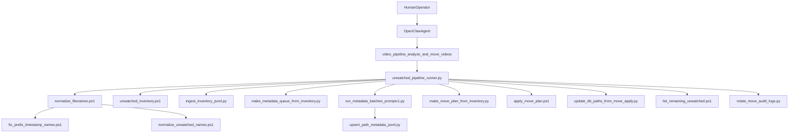

# video-library-pipeline flow and ownership

This document defines execution order, ownership boundaries, and data responsibilities for the OpenClaw `video-library-pipeline` plugin.

## 1) layer responsibilities

- OpenClaw agent/tool layer (`src/*.ts`)
  - receives tool call: `video_pipeline_analyze_and_move_videos`
  - resolves script path and runtime arguments
  - starts runner with `uv run python ...`
  - returns run result payload
- WSL Python layer (`py/*.py`)
  - orchestrates pipeline stages
  - ingests and updates DB state
  - generates plan/intermediate artifacts and summary
- Windows PowerShell layer (`<windowsOpsRoot>/scripts/*.ps1`)
  - performs Windows filesystem operations under source/destination roots
  - emits per-operation audit JSONL

## 2) key runtime parameters

- `sourceRoot`: source folder containing videos to analyze and move
- `destRoot`: destination root folder where organized videos are moved
- `windowsOpsRoot`: Windows operation/data root (scripts + outputs), for example `<windowsOpsRoot>`
- `maxFilesPerRun`: maximum file count handled in one run (applies to queue generation and move-plan generation)

## 3) ordered processing flow

1. Human configures plugin values (`db`, `sourceRoot`, `destRoot`, `windowsOpsRoot`, `defaultMaxFilesPerRun`).
2. Human or agent triggers `video_pipeline_analyze_and_move_videos`.
3. `src/tool-run.ts` executes:
   - `uv run python <extension>/py/unwatched_pipeline_runner.py --max-files-per-run ... [--apply] [--allow-needs-review] [--db ...] [--source-root ...] [--dest-root ...] [--windows-ops-root ...]`
4. Runner initializes `move` and `llm` roots under `windowsOpsRoot`.
5. Runner calls `normalize_filenames.ps1` (single normalization entrypoint).
   - internal phases:
     - `fix_prefix_timestamp_names.ps1`
     - `normalize_unwatched_names.ps1`
6. Runner calls `unwatched_inventory.ps1` and captures latest `inventory_unwatched_*.jsonl`.
7. Runner calls `ingest_inventory_jsonl.py` to upsert `paths`/`observations`.
8. Runner calls `make_metadata_queue_from_inventory.py` to create queue.
9. Runner calls `run_metadata_batches_promptv1.py`.
   - writes `llm_filename_extract_input_*` and `llm_filename_extract_output_*`
   - internally upserts `path_metadata`
10. Runner calls `make_move_plan_from_inventory.py` to build move plan.
11. Runner calls `apply_move_plan.ps1` (dry-run or apply).
12. Runner calls `update_db_paths_from_move_apply.py` to reconcile DB.
13. Runner calls `list_remaining_unwatched.ps1` and writes `remaining_unwatched_*.txt`.
14. Runner calls `rotate_move_audit_logs.py` for move+llm retention.
15. Runner writes `move/LATEST_SUMMARY.md`.
16. Runner prints final JSON summary and tool returns it.

### execution diagram

## 4) three-layer history model

- DB layer (normalized state and query layer)
  - `runs`, `events`, `paths`, `observations`, `path_metadata`
  - best for status/history queries
- JSONL layer (raw runtime evidence)
  - per-run/per-stage audit artifacts and input/output snapshots
  - best for forensic debugging and replay validation
- Summary layer (human-readable operations)
  - `move/LATEST_SUMMARY.md`
  - best for daily operational checks without reading raw JSONL

## 5) stage ownership map

| stage | target | read by | written by | primary consumer |
|---|---|---|---|---|
| config load | plugin config | `src/tool-run.ts` | human | agent + tools |
| rules load | `<windowsOpsRoot>/rules/program_aliases.json` | extraction script | human/agent | extraction stage |
| inventory snapshot | `move/inventory_unwatched_*.jsonl` | ingest/plan scripts | `unwatched_inventory.ps1` | scripts |
| db ingest/reconcile | `<windowsOpsRoot>/db/mediaops.sqlite` | core scripts | core scripts | scripts + human diagnostics |
| llm artifacts | `llm/queue_*`, `llm_filename_extract_input_*`, `llm_filename_extract_output_*` | extraction scripts | extraction scripts | scripts + debugging |
| move plan | `move/move_plan_from_inventory_*.jsonl` | `apply_move_plan.ps1` | planning script | scripts |
| move apply audit | `move/move_apply_*.jsonl` | db reconcile script | `apply_move_plan.ps1` | scripts + audit |
| remaining view | `move/remaining_unwatched_*.txt` | humans/status | runner | human + agent |
| summary | `move/LATEST_SUMMARY.md` | humans/status | runner | humans first |

## 6) active vs maintenance Windows scripts

- active in main flow:
  - `normalize_filenames.ps1`
  - `fix_prefix_timestamp_names.ps1` (called by normalize entrypoint)
  - `normalize_unwatched_names.ps1` (called by normalize entrypoint)
  - `unwatched_inventory.ps1`
  - `apply_move_plan.ps1`
  - `list_remaining_unwatched.ps1`
- maintenance-only:
  - `repair_collisions_nested_drive.ps1`
  - `rollback_rename_jsonl.ps1`

## 7) boundary rules

- filesystem mutate/enumerate under Windows source/destination roots must stay in `ps1`.
- Python owns orchestration + DB + artifact management, not direct Windows move/rename logic.
- new outputs must stay in active roots:
  - `.../move` for operational/audit artifacts
  - `.../llm` for extraction intermediate artifacts
  - `.../rules` for policy input
