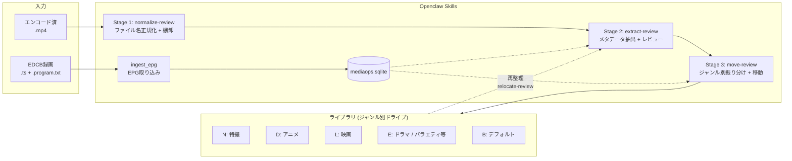
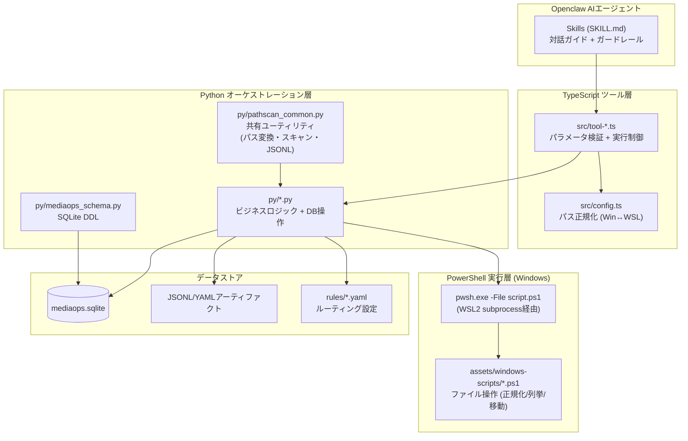
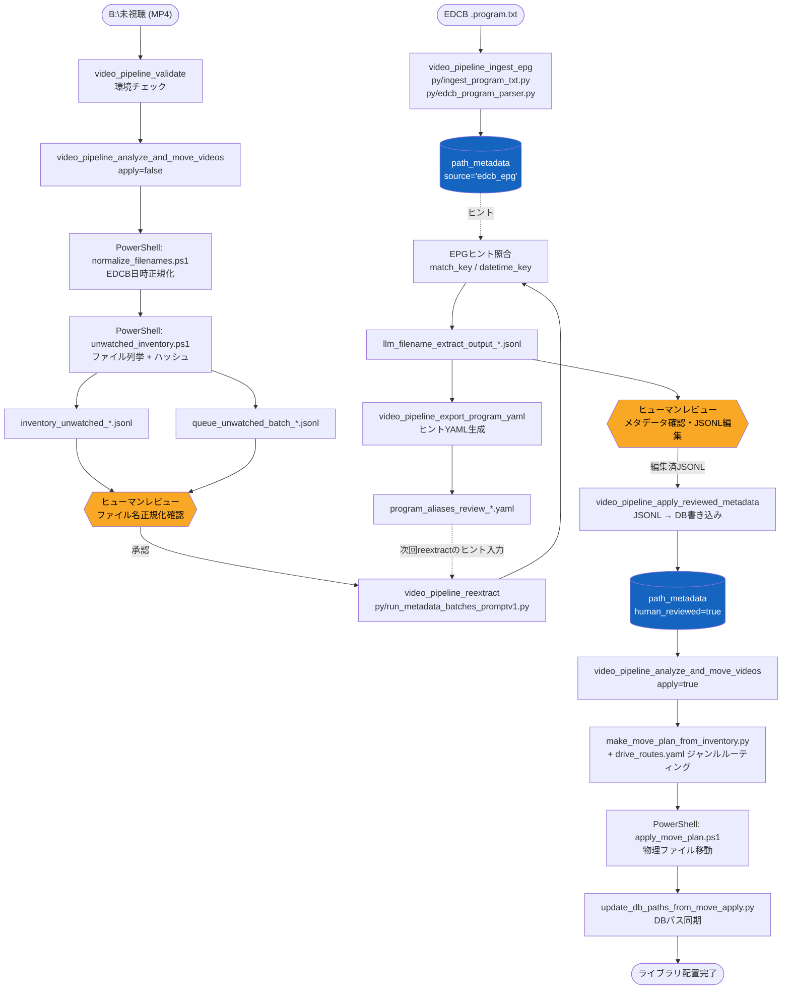
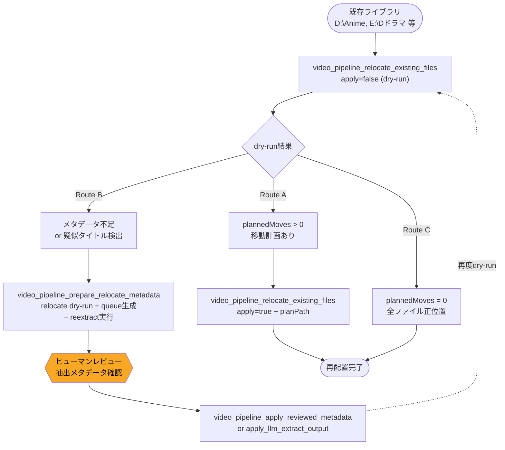
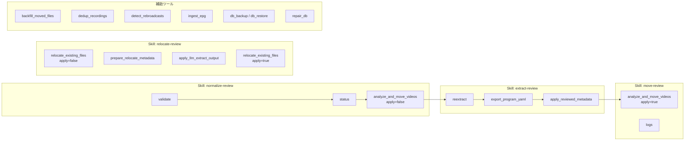
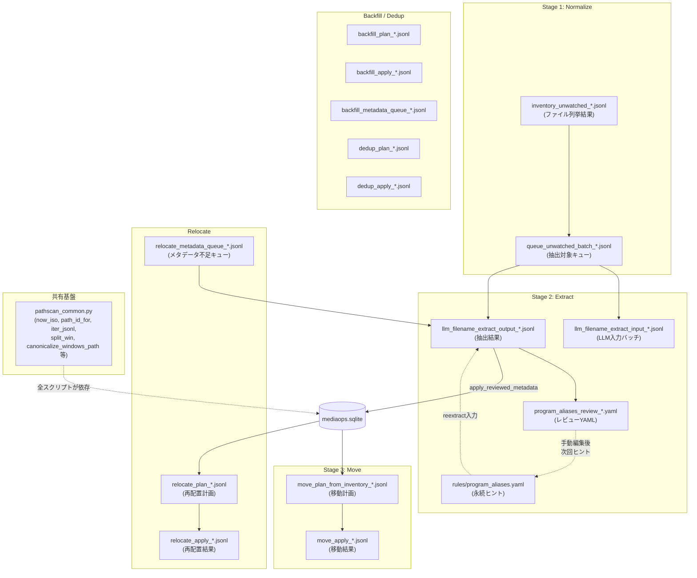
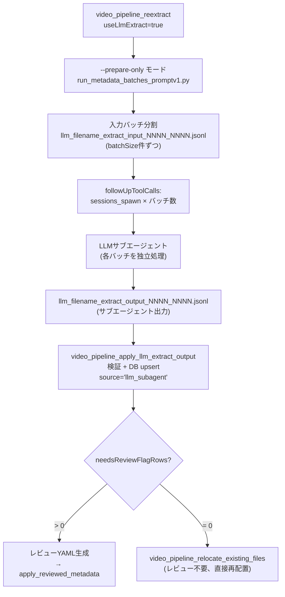

# video-library-pipeline

EDCB録画ファイルをエンコード後のMP4として受け取り、メタデータ抽出・ヒューマンレビュー・ジャンル別ドライブ振り分けまでを一貫して行うOpenclawプラグイン。

WSL2上のPython/TypeScriptと、Windows側のPowerShell 7を協調させ、SQLiteデータベースで全操作を追跡する。

---

## 1. アーキテクチャ概要



> **relocate-review** は既存ライブラリの再整理用フロー。Stage 2-3 を再利用してメタデータ補完・再配置を行う。

## 2. レイヤー構成



**PowerShellスクリプトが必要な理由:**

Windowsファイル操作をWSL2 Python側から直接行わずPowerShellに委譲している理由は主に2点:

1. **長パス制限 (MAX_PATH 260文字)**: `_long_path_utils.ps1` が全スクリプトから dot-source される共通ライブラリで、`\\?\` プレフィックスを付与して `System.IO.File/Directory` の .NET APIを直接呼ぶことで制限を回避している。WSL2の `/mnt/d/...` 経由ではこの回避ができない。
2. **Unicode正規化バグ**: PowerShellの出力を Python側で NFKC 正規化するとパス文字列のコードポイントが変わり、`src_not_found` エラーが発生することが判明。`windows_pwsh_bridge.py` に「出力テキストを正規化するな」というコメントが明示的に残っている。

スクリプトは起動時に `ensureWindowsScripts()` が `assets/windows-scripts/` テンプレートから `windowsOpsRoot/scripts/` へ自動コピー・更新する。

### PowerShellスクリプト一覧

| スクリプト                       | 用途                                                                  | 呼び出し元                                                                                |
| -------------------------------- | --------------------------------------------------------------------- | ----------------------------------------------------------------------------------------- |
| `_long_path_utils.ps1`         | 共通ライブラリ。`\\?\` 長パス対応の File/Directory 操作関数群       | 全スクリプトから dot-source                                                               |
| `normalize_filenames.ps1`      | ファイル名正規化ラッパー。内部でサブスクリプト2本を呼ぶ               | `unwatched_pipeline_runner.py` (Stage 1)                                                |
| `unwatched_inventory.ps1`      | sourceRoot のファイル列挙 → JSONL出力 (単一ルート、ハッシュ生成対応) | `unwatched_pipeline_runner.py` (Stage 1)                                                |
| `enumerate_files_jsonl.ps1`    | 汎用ファイル列挙 → JSONL出力 (複数ルート対応、破損検出対応)          | `pathscan_common.py` (backfill/relocate)                                                |
| `apply_move_plan.ps1`          | 移動計画JSONL → 物理ファイル移動。行ごとに ok/error を記録           | `unwatched_pipeline_runner.py`, `relocate_existing_files.py`, `dedup_recordings.py` |
| `list_remaining_unwatched.ps1` | sourceRoot の残存ファイル一覧 (プレーンテキスト出力)                  | `unwatched_pipeline_runner.py`                                                          |

> **既知の問題と改善TODO:**
>
> - **normalize_filenames.ps1**: 内部で呼ぶ `fix_prefix_timestamp_names.ps1`（録画日時書式の正規化）と `normalize_unwatched_names.ps1`（ファイル名正規化）が欠落しており、実質ノーオペレーション。両スクリプトは過去に存在したが削除された経緯がある。日本語の長いファイルパスを扱う必要があったためWindows側スクリプトとして実装されていた。再実装するか、ラッパーを削除するか判断が必要。
> - **enumerate_files_jsonl.ps1 と unwatched_inventory.ps1 の統合**: 同種の処理（ファイル列挙→JSONL）を行う2スクリプトが存在する。JSONLアーティファクトの種類が多すぎるとAIエージェント側が混乱するリスクがあるため、将来的に統合してアーティファクト数を削減する。
> - **apply_move_plan.ps1 のエラー報告改善**: JSONL行ごとに `ok=true/false` を記録済みだが、Python側でこれを集計してTypeScript層にサマリーとして返す仕組みがない（問題点#6と関連）。
> - **list_remaining_unwatched.ps1**: 使用実績が不明。`REQUIRED_WINDOWS_SCRIPTS` に含まれているが、必要性を再検討する。

---

## 3. メインパイプライン (sourceRoot)

パイプラインは**ステージ間にヒューマンレビューゲート**を設け、自動処理の暴走を防止する。



---

## 4. Relocateフロー

既存ライブラリのファイルを正しいフォルダ構成に再配置するフロー。`relocate-review` Skillが誘導する。



`prepare_relocate_metadata` は複合オーケストレーターで、内部で以下を順に実行する:

1. relocate dry-run (`queueMissingMetadata=true, writeMetadataQueueOnDryRun=true`)
2. メタデータ不足ファイルのキューJSONL生成
3. `reextract` によるルールベースメタデータ抽出
4. `followUpToolCalls` で export_program_yaml → apply_reviewed_metadata → relocate dry-run を指示

---

## 5. Skillフロー

各SkillはOpenclawのAIエージェントが呼び出すインタラクティブガイドであり、内部で複数のツールを順序立てて実行する。

| Skill                      | 概要                                                                                |
| -------------------------- | ----------------------------------------------------------------------------------- |
| `video-library-pipeline` | トップレベルインテントルーター。ユーザーの意図を判別し適切なSkillに誘導する         |
| `normalize-review`       | Stage 1 — 未視聴フォルダのファイル名正規化と棚卸を行う                             |
| `extract-review`         | Stage 2 — ファイル名からメタデータを抽出し、ヒューマンレビューを経てDBに書き込む   |
| `move-review`            | Stage 3 — レビュー済みメタデータに基づき、ジャンル別ドライブにファイルを振り分ける |
| `relocate-review`        | 既存ライブラリの再配置。メタデータ補完→dry-run→apply のサイクルを誘導する         |



---

## 6. ツール一覧

### 6a. followUpToolCallsパターン

多くのツールは戻り値に `followUpToolCalls` 配列を含む。これは「次に呼ぶべきツールとそのパラメータ」をツール自身が指示するチェーニング設計であり、AIエージェントがフローを自律的に進行できるようにする。

**対応ツール:**

- `relocate_existing_files` — dry-run後にapplyまたはprepare_relocate_metadataを指示
- `prepare_relocate_metadata` — reextract後にexport_program_yaml → apply_reviewed_metadata → relocate dry-runを指示
- `apply_llm_extract_output` — レビュー不要時はrelocateへ直接誘導
- `reextract` (LLMモード) — sessions_spawn → apply_llm_extract_outputを指示
- `export_program_yaml` — 生成YAMLパスを返す

### 6b. 各ツール詳細

#### `video_pipeline_analyze_and_move_videos` — メインパイプライン

sourceRoot (未視聴フォルダ) のファイルを正規化・棚卸し、メタデータに基づきジャンル別ドライブへ移動する。

| パラメータ           | 型      | 説明                                                                            |
| -------------------- | ------- | ------------------------------------------------------------------------------- |
| `apply`            | boolean | `false`=dry-run (Stage 1: normalize+inventory), `true`=実行 (Stage 3: move) |
| `maxFilesPerRun`   | integer | 1回の処理上限 (default: 200)                                                    |
| `allowNeedsReview` | boolean | `needs_review=true`のファイルも移動対象に含める (default: false)              |

内部で `unwatched_pipeline_runner.py` を実行し、`drive_routes.yaml` に基づくジャンルルーティングを適用する。

---

#### `video_pipeline_backfill_moved_files` — 既存ファイルDB同期

既存ライブラリのファイルをスキャンしDBに登録する（物理移動なし）。paths/file_paths/observations テーブルに upsert する。

| パラメータ               | 型                                | 説明                                                      |
| ------------------------ | --------------------------------- | --------------------------------------------------------- |
| `apply`                | boolean                           | `false`=dry-run, `true`=DB書き込み                    |
| `roots`                | string[]                          | スキャン対象Windowsパス。省略時は `backfill_roots.yaml` |
| `extensions`           | string[]                          | 対象拡張子 (default:`[".mp4"]`)                         |
| `limit`                | integer                           | 処理上限ファイル数                                        |
| `includeObservations`  | boolean                           | サイズ・mtime観測も記録 (default: true)                   |
| `queueMissingMetadata` | boolean                           | メタデータ未登録ファイルをreextractキューに追加           |
| `detectCorruption`     | boolean                           | 先頭バイト読み取りによる破損検出 (default: true)          |
| `scanErrorPolicy`      | `warn`\|`fail`\|`threshold` | スキャンエラー時の挙動                                    |

---

#### `video_pipeline_relocate_existing_files` — 既存ライブラリ再配置

既存ライブラリのファイルをDBメタデータに基づき正しいフォルダに移動する。dry-run/applyの2段階実行。

| パラメータ                     | 型                           | 説明                                                               |
| ------------------------------ | ---------------------------- | ------------------------------------------------------------------ |
| `apply`                      | boolean                      | `false`=dry-run (移動計画生成), `true`=物理移動実行            |
| `planPath`                   | string                       | apply時必須。dry-runが返す計画ファイルパス                         |
| `roots`                      | string[]                     | スキャン対象。省略時は `relocate_roots.yaml`                     |
| `allowNeedsReview`           | boolean                      | `needs_review=true`のファイルも移動対象に含める (default: false) |
| `queueMissingMetadata`       | boolean                      | メタデータ不足ファイルをキューに収集                               |
| `writeMetadataQueueOnDryRun` | boolean                      | dry-run時もキューファイルを書き出す                                |
| `onDstExists`                | `error`\|`rename_suffix` | 移動先に同名ファイルが存在する場合の挙動                           |

**安全機構:**

- apply時に `planPath` の存在確認 + 24時間以内の鮮度チェック
- apply前に自動DBバックアップ + ローテーション (最新10世代)
- `followUpToolCalls` でRoute A (apply可能) / Route B (メタデータ準備必要) / Route C (移動不要) を分岐

---

#### `video_pipeline_prepare_relocate_metadata` — relocate用メタデータ一括準備

relocateフロー専用の複合オーケストレーター。内部で relocate dry-run (キュー生成付き) → reextract を連続実行する。

| パラメータ                    | 型                | 説明                                             |
| ----------------------------- | ----------------- | ------------------------------------------------ |
| `roots` / `rootsFilePath` | string[] / string | スキャン対象                                     |
| `runReextract`              | boolean           | reextractも実行するか (default: true)            |
| `batchSize`                 | integer           | reextractバッチサイズ (default: 50)              |
| `maxBatches`                | integer           | 最大バッチ数                                     |
| `preserveHumanReviewed`     | boolean           | human_reviewed済みレコードを保護 (default: true) |

成功時は `followUpToolCalls` で export_program_yaml → apply_reviewed_metadata → relocate dry-run の連鎖を指示する。

---

#### `video_pipeline_reextract` — メタデータ再抽出

キューJSONLからメタデータを再抽出する。ルールベースエンジンとLLMサブエージェントの2モードを持つ。

| パラメータ                | 型      | 説明                                                |
| ------------------------- | ------- | --------------------------------------------------- |
| `queuePath`             | string  | 入力キューJSONL。省略時はデフォルトキューを自動生成 |
| `useLlmExtract`         | boolean | `true`=LLMサブエージェントモード (default: false) |
| `llmModel`              | string  | LLMモデル指定 (default:`claude-opus-4-6`)         |
| `batchSize`             | integer | バッチサイズ (default: 50)                          |
| `maxBatches`            | integer | 最大バッチ数                                        |
| `preserveHumanReviewed` | boolean | human_reviewed済みレコードを保護 (default: true)    |

**ルールベースモード** (`useLlmExtract=false`): `run_metadata_batches_promptv1.py` でファイル名パターンマッチング + EPGヒント照合。`followUpToolCalls` で `export_program_yaml` を指示。

**LLMサブエージェントモード** (`useLlmExtract=true`): `--prepare-only` で入力バッチJSONLのみ生成し、`followUpToolCalls` で `sessions_spawn` → `apply_llm_extract_output` の連鎖を指示。詳細はセクション8参照。

---

#### `video_pipeline_apply_reviewed_metadata` — レビュー済みメタデータDB適用

ヒューマンレビュー済みのJSONLファイルをDBに書き込む。2段ゲートで誤適用を防止する（セクション12参照）。

| パラメータ                | 型      | 説明                                                       |
| ------------------------- | ------- | ---------------------------------------------------------- |
| `sourceJsonlPath`       | string  | レビュー済みJSONLのパス（生ファイル名は拒否される）        |
| `markHumanReviewed`     | boolean | `human_reviewed=true` を付与 (default: true)             |
| `allowNoContentChanges` | boolean | 内容未変更でも適用を許可 (default: false)                  |
| `source`                | string  | `path_metadata.source` に記録する値 (default: `"llm"`) |

**安全機構:** apply前に自動DBバックアップ + ローテーション (最新10世代)。適用成功後、`program_aliases_review_*.yaml` をアーカイブに移動。

---

#### `video_pipeline_apply_llm_extract_output` — LLMサブエージェント結果統合

LLMサブエージェントが書き出した抽出結果JSONLを検証し、`source='llm_subagent'` でDBに upsert する。

| パラメータ          | 型      | 説明                                              |
| ------------------- | ------- | ------------------------------------------------- |
| `outputJsonlPath` | string  | **必須**。サブエージェントが書いたJSONLパス |
| `dryRun`          | boolean | 検証のみ (default: false)                         |

サブタイトル区切り文字の混入チェック、program_title長さ検証、型の強制変換を行う。問題のあるレコードは `needs_review=true` にマークして保存（拒否ではなく保全）。

**分岐:**

- `needsReviewFlagRows > 0`: レビューYAMLを生成し、`apply_reviewed_metadata` へ誘導
- `needsReviewFlagRows = 0`: レビュー不要。`relocate_existing_files` へ直接誘導

---

#### `video_pipeline_dedup_recordings` — 重複検出

`czkawka_cli` (BLAKE3ハッシュスキャン) と DBメタデータを組み合わせて重複録画を検出し、drop候補を隔離する。

| パラメータ                 | 型      | 説明                                    |
| -------------------------- | ------- | --------------------------------------- |
| `apply`                  | boolean | `false`=dry-run, `true`=隔離実行    |
| `maxGroups`              | integer | 処理する重複グループ上限                |
| `confidenceThreshold`    | number  | 重複判定の信頼度閾値 (default: 0.85)    |
| `keepTerrestrialAndBscs` | boolean | 地上波・BS/CSを優先保持 (default: true) |
| `bucketRulesPath`        | string  | バケットルールYAML                      |

**czkawka-cli プラグイン連携アーキテクチャ:**

重複検出は `czkawka-cli` という別Openclawプラグインに依存する。`openclaw.plugin.json` で `"requires": {"plugins": ["czkawka-cli"]}` を宣言しており、プラグインの読み込み順序が保証される。

```
czkawka-cli プラグイン (別拡張)
├── 5ツール登録: plugin_status, validate, cache_info, dup_hash_scan, similar_video_scan
├── config.czkawkaCliPath → czkawka_cli バイナリの絶対パス
└── before_tool_call フック → 直接CLI呼び出しを検出して警告

video-library-pipeline (本プラグイン)
└── tool-dedup.ts
    ├── api.config.plugins.entries["czkawka-cli"].config からバイナリパスを取得
    ├── spawnSync(czkawkaCliPath, ["dup", "--search-method", "HASH", ...]) で直接実行
    └── czkawka-cli プラグインのツール (dup_hash_scan等) は使用しない
```

設計上、`dedup_recordings` は czkawka-cli プラグインの **設定のみ** を参照し、ツールは経由しない。これは dedup のフローが czkawka スキャン→Python判定→PowerShell隔離の一連のパイプラインであり、途中でツール境界を置くとエラーハンドリングが複雑化するため。czkawka の出力は一時 JSON (`/tmp/dedup_hash_*.json`) に書き出され、Python スクリプト `dedup_recordings.py` が DB メタデータと突合してdrop候補を決定する。

---

#### 簡潔記載ツール

| ツール                                        | 用途                                                     | 主要パラメータ                       |
| --------------------------------------------- | -------------------------------------------------------- | ------------------------------------ |
| `video_pipeline_validate`                   | 環境・設定チェック                                       | —                                   |
| `video_pipeline_status`                     | パイプラインの最新状態サマリ (各ステージの最新JSONL等)   | `includeRawPaths`                  |
| `video_pipeline_export_program_yaml`        | 抽出結果からヒントYAML生成                               | `sourceJsonlPath`                  |
| `video_pipeline_ingest_epg`                 | EDCB `.program.txt` からEPG番組情報を取り込み          | —                                   |
| `video_pipeline_detect_rebroadcasts`        | 再放送グルーピング (broadcast_groups テーブル)           | —                                   |
| `video_pipeline_db_backup` / `db_restore` | DBスナップショットの作成・復元                           | `action`, `descriptor`, `keep` |
| `video_pipeline_repair_db`                  | paths テーブルの drive/dir/name 分解値を path から再生成 | —                                   |
| `video_pipeline_logs`                       | 監査ログ (events テーブル) の参照                        | —                                   |

---

## 7. データフロー図

JSONL/YAMLアーティファクトの生成・消費関係を示す。



### windowsOpsRoot ディレクトリ構成

上記アーティファクトの物理配置先。設定値 `windowsOpsRoot` (デフォルト: `B:\_AI_WORK`) 配下に以下の構造で展開される。

```
B:\_AI_WORK/                          ← windowsOpsRoot
├── db/
│   ├── mediaops.sqlite               ← メインDB
│   ├── mediaops.sqlite.bak_*         ← 自動バックアップ (最新10世代ローテーション)
│   ├── tablacus_label.db             ← Tablacus連携用 (外部)
│   └── tablacus_label3.db
├── llm/
│   ├── llm_filename_extract_input_*.jsonl   ← reextract入力バッチ
│   ├── llm_filename_extract_output_*.jsonl  ← 抽出結果
│   ├── program_aliases_review_*.yaml        ← レビューYAML (apply後にarchive/へ移動)
│   ├── queue_unwatched_batch_*.jsonl        ← 未視聴キュー
│   ├── relocate_metadata_queue_*.jsonl      ← relocateメタデータ不足キュー
│   ├── reviewed_metadata_*.yaml             ← レビュー済みメタデータ
│   └── archive/                             ← 処理済みアーティファクトの退避先
├── move/
│   ├── inventory_unwatched_*.jsonl          ← Stage 1 棚卸結果
│   ├── move_plan_from_inventory_*.jsonl     ← Stage 3 移動計画
│   ├── move_apply_*.jsonl                   ← Stage 3 移動結果
│   ├── relocate_plan_*.jsonl                ← relocate移動計画
│   ├── remaining_unwatched_*.txt            ← 残存未視聴リスト
│   └── archive/                             ← ローテーション済みアーティファクト (.gz)
├── scripts/                                 ← ensureWindowsScripts()が自動配置するps1
│   ├── _long_path_utils.ps1
│   ├── normalize_filenames.ps1
│   ├── unwatched_inventory.ps1
│   ├── apply_move_plan.ps1
│   ├── enumerate_files_jsonl.ps1
│   └── list_remaining_unwatched.ps1
├── duplicates/
│   └── quarantine/                          ← dedup_recordingsの隔離先
├── quarantine/                              ← (未使用)
├── inventory/                               ← (未使用、レガシー)
└── .gitignore                               ← ランタイムデータを除外
```

`archive/` ディレクトリ内のファイルは `.gz` 圧縮され、定期ローテーションで古いアーティファクトが自動退避される。

---

## 8. LLMサブエージェントフロー

`useLlmExtract=true` 時のフロー。ルールベースエンジンの代わりにLLMサブエージェントを起動してメタデータを抽出する。



**バッチ分割の仕組み:**

- `reextract` は `--prepare-only` でキューJSONLを `batchSize` 件ずつの入力バッチに分割
- 各入力バッチに対応する出力ファイルパスを事前に決定 (`_input_` → `_output_`)
- `followUpToolCalls` にて `sessions_spawn` (サブエージェント起動) と `apply_llm_extract_output` (結果統合) を順に指示
- サブエージェントは入力JSONLの読み取り → メタデータ抽出 → 出力JSONL書き出し → `apply_llm_extract_output` 呼び出しを自律的に実行

---

## 9. DBスキーマ (mediaops.sqlite)

```mermaid
erDiagram
    runs {
        TEXT run_id PK
        TEXT kind
        TEXT target_root
        TEXT started_at
        TEXT finished_at
        TEXT tool_version
        TEXT notes
    }

    paths {
        TEXT path_id PK
        TEXT path UK
        TEXT drive
        TEXT dir
        TEXT name
        TEXT ext
        TEXT created_at
        TEXT updated_at
    }

    files {
        TEXT file_id PK
        INTEGER size_bytes
        TEXT content_hash
        TEXT hash_algo
        TEXT created_at
        TEXT updated_at
    }

    file_paths {
        TEXT file_id FK
        TEXT path_id FK
        INTEGER is_current
        TEXT first_seen_run_id FK
        TEXT last_seen_run_id FK
    }

    observations {
        TEXT run_id FK
        TEXT path_id FK
        INTEGER size_bytes
        TEXT mtime_utc
        TEXT type
        TEXT name_flags
    }

    events {
        INTEGER event_id PK
        TEXT run_id FK
        TEXT ts
        TEXT kind
        TEXT src_path_id FK
        TEXT dst_path_id FK
        TEXT detail_json
        INTEGER ok
        TEXT error
    }

    path_metadata {
        TEXT path_id PK-FK
        TEXT source
        TEXT data_json
        TEXT updated_at
    }

    tags {
        INTEGER tag_id PK
        TEXT name
        TEXT namespace
    }

    path_tags {
        TEXT path_id FK
        INTEGER tag_id FK
        TEXT source
        TEXT updated_at
    }

    broadcast_groups {
        TEXT group_id PK
        TEXT program_title
        TEXT episode_key
        TEXT created_at
    }

    broadcast_group_members {
        TEXT group_id FK
        TEXT path_id FK
        TEXT broadcast_type
        TEXT air_date
        TEXT broadcaster
        TEXT added_at
    }

    files ||--o{ file_paths : "has paths"
    paths ||--o{ file_paths : "linked to files"
    runs ||--o{ file_paths : "first/last seen"
    runs ||--o{ observations : "observed in"
    paths ||--o{ observations : "observed as"
    runs ||--o{ events : "triggered"
    paths ||--o{ events : "src/dst"
    paths ||--|| path_metadata : "has metadata"
    paths ||--o{ path_tags : "tagged"
    tags ||--o{ path_tags : "applied to"
    broadcast_groups ||--o{ broadcast_group_members : "contains"
    paths ||--o{ broadcast_group_members : "member of"
```

**テーブル概要:**

| テーブル                                           | 役割                                                               |
| -------------------------------------------------- | ------------------------------------------------------------------ |
| `runs`                                           | パイプライン実行の監査ログ                                         |
| `paths`                                          | ファイルパスの正規化レジストリ (drive/dir/name/ext に分解)         |
| `files`                                          | ファイル実体 (サイズ・コンテンツハッシュ)                          |
| `file_paths`                                     | files↔paths の多対多マッピング (移動履歴を `is_current` で追跡) |
| `observations`                                   | 実行時のファイル状態スナップショット (size/mtime)                  |
| `events`                                         | 移動・リロケート等のアクション記録 (成否追跡)                      |
| `path_metadata`                                  | 抽出メタデータ (source + data_json にJSONで格納)                   |
| `tags` / `path_tags`                           | Tablacus連携用タグ                                                 |
| `broadcast_groups` / `broadcast_group_members` | 再放送グルーピング (original/rebroadcast 分類)                     |

### path_id 生成

```python
path_id = str(uuid.uuid5(PATH_NAMESPACE, "winpath:" + normalize_win_for_id(path)))
```

`normalize_win_for_id` はWindowsパスを正規化（大文字小文字統一、区切り文字統一等）し、同一ファイルに対して常に同じ `path_id` が生成されることを保証する。

### data_json 必須フィールド契約

```python
DB_CONTRACT_REQUIRED = {"program_title", "air_date", "needs_review"}
```

- `program_title` — 番組タイトル (サブタイトルを含めない)
- `air_date` — 放送日 (`YYYY-MM-DD`)
- `needs_review` — ヒューマンレビュー待ちフラグ (boolean)

### source 値一覧

| source値         | 意味                    | 生成元                               |
| ---------------- | ----------------------- | ------------------------------------ |
| `llm`          | ルールベース抽出        | `run_metadata_batches_promptv1.py` |
| `llm_subagent` | LLMサブエージェント抽出 | `apply_llm_extract_output.py`      |
| `edcb_epg`     | EPG取り込み             | `ingest_program_txt.py`            |

> **TODO:** `source='llm'` はルールベース抽出（正規表現 + パターンマッチング）に付く値で、実際にはLLMを呼んでいない。歴史的命名の残滓であり誤解を招くため、将来的に `rule_based` 等に改名する。DB移行スクリプトが必要。

### is_current 運用

`file_paths.is_current` はファイル移動時に旧パス=`0`、新パス=`1` に更新される。これにより複数パスで同一ファイルの移動履歴を追跡できる。`is_current=1` のレコードが現在のファイル位置を示す。

---

## 10. ジャンル別ドライブルーティング

`rules/drive_routes.yaml` に基づき、EPGジャンルまたはタイトルパターンで振り分け先を決定する。上から順にマッチ判定し、最初にマッチしたルートに振り分ける。

| ジャンル               | 振り分け先                     | レイアウト                |
| ---------------------- | ------------------------------ | ------------------------- |
| 特撮                   | `N:\`                        | `by_series`             |
| アニメ                 | `D:\Anime`                   | `by_series` ※TODO      |
| 映画                   | `L:\`                        | `by_syllabary`          |
| ドラマ                 | `E:\Dドラマ`                 | `by_series` ※TODO      |
| ドキュメンタリー・情報 | `E:\Dドキュメンタリー･情報` | `by_program_year_month` |
| バラエティ             | `E:\Bバラエティ`             | `by_program_year_month` |
| ニュース・報道         | `E:\Nニュース・報道`         | `by_program_year_month` |
| 放送大学               | `B:\放送大学`                | `by_program_year_month` |
| (デフォルト)           | `B:\VideoLibrary`            | `by_program_year_month` |

> **TODO (※):** アニメ・ドラマは `by_program_year_month` → `by_series` への移行を予定。`drive_routes.yaml` の変更後、既存ファイルに `relocate_existing_files` を実施する必要がある。現状の `drive_routes.yaml` はまだ `by_program_year_month`。

### レイアウトタイプ

| タイプ                    | フォルダ構成                                     | 用途                                |
| ------------------------- | ------------------------------------------------ | ----------------------------------- |
| `by_program_year_month` | `<root>/<program_title>/<year>/<month>/<file>` | 大部分のジャンルで使用              |
| `by_syllabary`          | `<root>/<五十音フォルダ(ア,カ,サ…)>/<file>`   | 映画                                |
| `by_series`             | `<root>/<program_title>/<file>` (年月なし)     | 特撮 (既存シリーズフォルダにマッチ) |
| `flat`                  | `<root>/<file>`                                | (現在未使用)                        |

> `by_series` と `by_syllabary` はシンプルな実装済みだが、将来的な改善余地あり (TODO)。

---

## 11. メタデータ契約

DBの `path_metadata`テーブルに格納されるメタデータは以下の3フィールドが必須:

```python
DB_CONTRACT_REQUIRED = {"program_title", "air_date", "needs_review"}
```

- `program_title` — 番組タイトル (サブタイトルを含めない)
- `air_date` — 放送日 (YYYY-MM-DD)
- `needs_review` — ヒューマンレビュー待ちフラグ (boolean)

`source` 値の詳細はセクション9「source 値一覧」を参照。

---

## 12. 安全機構

### apply_reviewed_metadata の2段ゲート

1. **生ファイル名拒否ゲート**: `llm_filename_extract_output_NNNN_NNNN.jsonl` 形式の生抽出ファイルは `markHumanReviewed=true` 時に無条件で拒否。`allowNoContentChanges` でもバイパス不可。レビュー済みコピーの使用を強制する。
2. **内容変更チェックゲート**: レビュー済みJSONLとベースライン抽出出力を比較し、変更が0行の場合は拒否。`allowNoContentChanges=true` で合法的にバイパス可能だが、疑似タイトル (`program_title` にサブタイトル区切り文字 ▽/▼ が混入) や `needs_review=true` のレコードが残存する場合はバイパス不可。

### dry-run/apply パターン

全apply系ツールに共通する安全設計:

- `apply=false` (dry-run) で計画を生成しレビュー
- `apply=true` で物理操作を実行
- 対象: `analyze_and_move_videos`, `relocate_existing_files`, `backfill_moved_files`, `dedup_recordings`

### 自動DBバックアップ

以下のツールはapply実行前に自動でDBバックアップを作成する:

- `relocate_existing_files` (apply=true 時、`descriptor=pre_relocate_apply`)
- `apply_reviewed_metadata` (`descriptor=pre_apply_reviewed_metadata`)

バックアップ後、自動ローテーションで最新10世代を保持。

### allowNeedsReview のデフォルト

`allowNeedsReview` は `relocate_existing_files` と `analyze_and_move_videos` の両方で **デフォルトfalse**。`needs_review=true` のファイルはレビュー完了まで移動計画から除外される。

---

## 13. 前提条件

| 要件        | 詳細                                                 |
| ----------- | ---------------------------------------------------- |
| OS          | WSL2 (Windows 11)                                    |
| PowerShell  | 7.x (`pwsh` コマンドで利用可能)                    |
| Python      | 3.10+ (`uv` でパッケージ管理)                      |
| Windows設定 | `LongPathsEnabled = 1` (レジストリ)                |
| 外部ツール  | `czkawka-cli` (重複検出、Openclawプラグインとして) |
| DB          | SQLite 3                                             |

**Python共有基盤:** `py/pathscan_common.py` が全Pythonスクリプトの共有ユーティリティ層として機能する。パス変換 (`normalize_win_for_id`, `canonicalize_windows_path`, `wsl_to_windows_path` 等)、path_id生成 (`path_id_for`)、JSONL読み込み (`iter_jsonl`)、ファイルスキャン (`scan_files`) など、横断的に使用される関数を集約している。`py/mediaops_schema.py` はSQLiteスキーマDDLとDB接続ヘルパーを提供する。

---

## 14. 処理フロー上の問題点と改善提案

### 1. Stage 2→3 間のゲートが暗黙的

**問題:** Stage 2で `apply_reviewed_metadata`を実行した後、Stage 3の `analyze_and_move_videos(apply=true)`への遷移にプログラム的なゲートがない。Skillのガイドテキストに依存しており、AIエージェントが誤ってレビュー未完了のまま移動を実行するリスクがある。

**提案:** `needs_review=true`が残存するファイルに対して移動計画生成をブロックする検証を `make_move_plan_from_inventory.py`に追加する。現状は `allowNeedsReview`パラメータで制御可能だが、デフォルトがfalseであることの明示的なドキュメントが不足している。

### 2. LLMサブエージェントフローのリカバリ機構がない

**問題:** `reextract`のLLMモード(`useLlmExtract=true`)では、`sessions_spawn`によるサブエージェント起動を返すが、サブエージェントの失敗・タイムアウト時のリトライ機構がない。途中で止まった場合、手動で `apply_llm_extract_output`を呼ぶ必要があり、どのバッチが未処理か追跡する仕組みがない。

**提案:** バッチ単位の進捗追跡テーブルまたはステータスJSONLの導入を検討する。

### 3. EPG照合の match_key 衝突リスク

**問題:** `ingest_program_txt.py`が生成する `match_key`は `program_title + datetime`の単純連結だが、同一時刻に同一タイトルの異なる放送局の番組が存在する場合（例: 同名の地方番組）、キーが衝突する可能性がある。

**提案:** `match_key`に `broadcaster`を含めるか、照合時に放送局を副条件として使用する。

### 4. relocateフローとメインフローのメタデータソース不整合

**問題:** メインフロー(Stage 1-3)は `source='llm'`でメタデータを格納するが、relocateフローで `prepare_relocate_metadata`を経由した場合も同じ `source='llm'`を使用する。relocateで処理したファイルがメインフローの出力と区別できず、監査時に処理経路の追跡が困難になる。

**提案:** relocate経由の場合は `source='llm_relocate'`等の識別子を使い分ける。

> **進捗注記:** `llm_subagent` sourceの導入により、LLMサブエージェント経由の抽出はメインフローと区別可能になった。ただしルールベース抽出 (`source='llm'`) 経由のrelocateフローは依然として区別できない。

### 5. DB バックアップの自動ローテーション上限が未定義

**問題:** `backup_mediaops_db.py`はapply前に自動バックアップを作成するが、ローテーション（古いバックアップの削除）ポリシーが明示されていない。長期運用でバックアップが蓄積し続ける可能性がある。

**提案:** 世代数（例: 最新10件）またはサイズ上限を設定し、自動ローテーションを実装する。

### 6. PowerShell スクリプトのエラーハンドリングが非同期で不透明

**問題:** TypeScript→Python→PowerShellの3層呼び出しにおいて、PowerShellの終了コードや標準エラー出力がPython層で十分にキャプチャされず、TypeScript層に到達した時点で「何かが失敗した」以上の詳細が失われるケースがある。特に `apply_move_plan.ps1`での部分的失敗（一部ファイルのみ移動失敗）の報告が不十分。

**提案:** PowerShellスクリプトから構造化エラーJSONを返却し、Python/TypeScript層でファイル単位の成否を伝播する。

### 7. program_aliases.yaml と reextract ヒントの循環依存

**問題:** `export_program_yaml`で生成されたYAMLを手動編集し、次回の `reextract`にヒントとして渡すフローだが、ヒントの適用結果がさらに新しいYAMLを生成し、どの世代のヒントが最終的に採用されたか追跡しにくい。`rules/program_aliases.yaml`（永続ヒント）と一時的なレビューYAMLの役割分担が曖昧。

**提案:** 永続ヒント(`rules/program_aliases.yaml`)と一時レビューYAML(`program_aliases_review_*.yaml`)の用途をより明確にドキュメント化し、レビューYAMLの採用済み/未採用ステータスを管理する。

### 8. Python重複コード整理 (完了)

**問題:** `now_iso`, `path_id_for`, `iter_jsonl`, `split_win` 等のユーティリティ関数が最大11ファイルにコピペされており、バグ修正時に全ファイルを修正する必要があった。関数名も不統一 (`normalize_win_path` vs `normalize_win_for_id`, `split_path` vs `split_win`, `iter_jsonl_file` vs `iter_jsonl`)。

**対応:** `pathscan_common.py` に `PATH_NAMESPACE`, `path_id_for`, `iter_jsonl` を追加し、全11スクリプトのローカル定義を削除して `from pathscan_common import ...` に統一。`backfill_moved_files.py` の中間rebindingパターンも完全に解消。`make_move_plan_from_inventory.py` は `sqlite3.connect` 直書きを `mediaops_schema.connect_db` に統一。

**残課題:** TypeScript層 (`src/tool-*.ts`) にも類似の重複パターンがあるが未着手。
