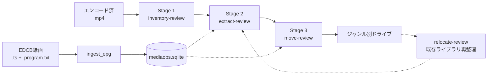

# video-library-pipeline

EDCB録画ファイルをエンコード後のMP4として受け取り、メタデータ抽出・ヒューマンレビュー・ジャンル別ドライブ振り分けまでを一貫して行うOpenClawプラグイン。

WSL2上のPython/TypeScriptと、Windows側のPowerShell 7を協調させ、SQLiteデータベースで全操作を追跡する。

## Documentation

READMEは入口だけを保持し、詳細な設計判断はADRへ分割している。

- [docs/CURRENT_SPEC_INDEX.md](docs/CURRENT_SPEC_INDEX.md): 現行仕様の読み順と情報源マッピング
- [docs/adr/README.md](docs/adr/README.md): ADR一覧
- [docs/adr/0002-pipeline-architecture-and-review-gates.md](docs/adr/0002-pipeline-architecture-and-review-gates.md): 全体パイプライン、Stage、Skillフロー
- [docs/adr/0003-windows-powershell-filesystem-boundary.md](docs/adr/0003-windows-powershell-filesystem-boundary.md): WSL2/Windows境界、PowerShellスクリプト、長パス対応
- [docs/adr/0004-tool-orchestration-and-follow-up-calls.md](docs/adr/0004-tool-orchestration-and-follow-up-calls.md): ツール一覧、followUpToolCalls、LLMサブエージェント
- [docs/adr/0005-metadata-and-artifact-lifecycle.md](docs/adr/0005-metadata-and-artifact-lifecycle.md): JSONL/YAML、`windowsOpsRoot`、source遷移
- [docs/adr/0006-mediaops-db-routing-and-safety.md](docs/adr/0006-mediaops-db-routing-and-safety.md): DBスキーマ、ジャンルルーティング、安全機構
- [docs/adr/0007-openclaw-sdk-recommended-plugin-implementation.md](docs/adr/0007-openclaw-sdk-recommended-plugin-implementation.md): OpenClaw SDK公式docsに基づくplugin推奨実装方針

既存/追加要件の背景は以下にも残っている。現行動作かどうかは必ず [docs/CURRENT_SPEC_INDEX.md](docs/CURRENT_SPEC_INDEX.md) を起点に確認する。

- [FLOW_AND_OWNERSHIP.md](FLOW_AND_OWNERSHIP.md)
- [DEPENDENCIES.md](DEPENDENCIES.md)
- [MULTIDRIVE_EPG_REQUIREMENTS.md](MULTIDRIVE_EPG_REQUIREMENTS.md)
- [BACKFILL_MOVED_FILES_REQUIREMENTS.md](BACKFILL_MOVED_FILES_REQUIREMENTS.md)
- [DUPLICATE_DEDUP_REQUIREMENTS.md](DUPLICATE_DEDUP_REQUIREMENTS.md)

## Repository Map

- `src/plugin/`: OpenClaw plugin登録、CLI、plugin hook
- `src/tools/`: `video_pipeline_*` ツールアダプタ
- `src/platform/`: 設定解決、ランタイム、PowerShellテンプレート同期
- `src/core/`: ツール間で共有するTypeScript実行ロジック
- `src/contracts/`: TypeScript側の共通型
- `py/*.py`: 現行の実行エントリポイントと互換ラッパー
- `py/video_pipeline/domain|db|platform/`: Python共有ロジックの本体
- `templates/windows-scripts/`: プラグイン同梱のPowerShellテンプレート本体
- `assets/windows-scripts/`: 移行期間中のレガシーフォールバック
- `skills/*/SKILL.md`: OpenClaw AIエージェント向けの実行ガイド
- `docs/adr/`: 設計判断の記録

`src/*.ts` と `py/*.py` の一部は後方互換のために残っている薄いラッパーであり、新規実装の配置先ではない。

## Architecture Summary



主要フローは次の2つ。

- sourceRootフロー: 未視聴フォルダを棚卸し、メタデータ抽出とレビューを経てジャンル別ドライブへ移動する。
- relocateフロー: 既存ライブラリをスキャンし、メタデータ不足を補完して正しいフォルダ構成へ再配置する。

## Operational Guardrails

- ステージ間にヒューマンレビューゲートを置き、`needs_review=true` のファイルはデフォルトで移動対象から除外する。
- 物理操作系ツールは `apply=false` のdry-runで計画を生成し、レビュー後に `apply=true` で実行する。
- Windowsファイル操作はWSL2から直接行わず、PowerShell 7テンプレートへ委譲する。
- `relocate_existing_files` と `apply_reviewed_metadata` はapply前にSQLite DBバックアップを作成し、最新10世代を保持する。
- `source=human_reviewed` は確定データ、`source=llm` はsuspicious titleチェック通過時のみ移動可能な推測データとして扱う。

詳細はADRを参照。

## Prerequisites

| 要件 | 詳細 |
|---|---|
| OS | WSL2 on Windows 11 |
| PowerShell | 7.x (`pwsh`) |
| Python | 3.10+ (`uv`でパッケージ管理) |
| Windows設定 | `LongPathsEnabled = 1` |
| 外部ツール | `czkawka-cli` OpenClawプラグイン |
| DB | SQLite 3 |

## Development

TypeScriptプラグイン層はVitest、Python実行層はpytestで検証する。

```bash
npm test
pytest
```

OpenClaw SDK testing方針の詳細は [docs/adr/0001-plugin-sdk-testing.md](docs/adr/0001-plugin-sdk-testing.md) を参照。
