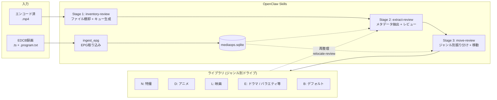
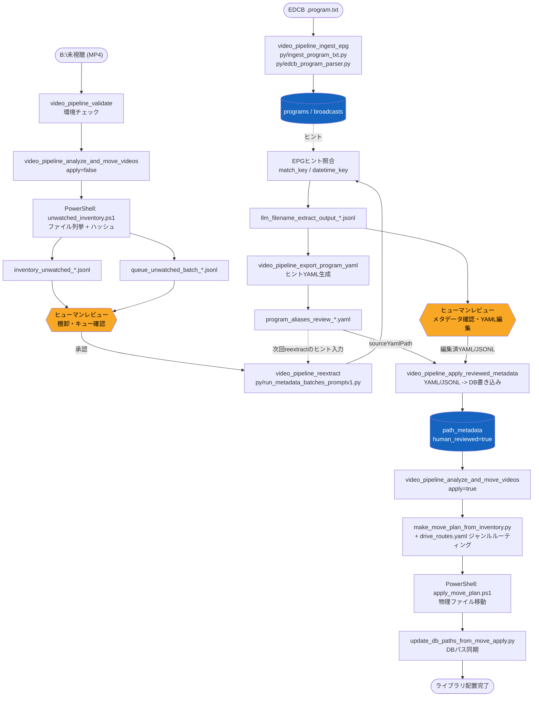
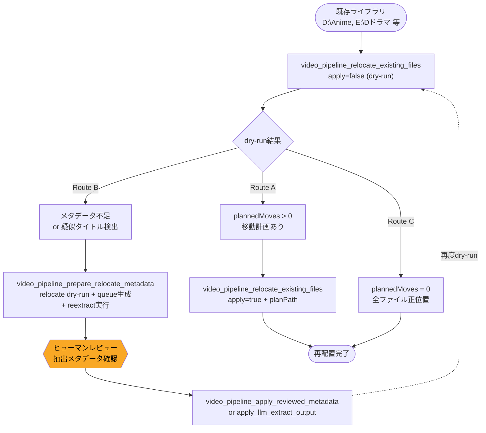
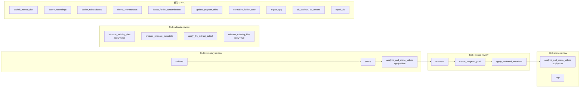

# ADR-0002: パイプライン構成とヒューマンレビューゲート

- Status: Accepted
- Date: 2026-04-23
- Source: README sections 1, 3, 4, 5 before ADR split

## Context

`video-library-pipeline` はEDCB録画から生成されたMP4を、棚卸、メタデータ抽出、レビュー、ジャンル別ドライブ移動まで処理する。AIエージェントがツールを連鎖実行するため、自動処理が誤ったメタデータや移動計画をそのまま適用しないよう、明示的なレビューゲートが必要である。

既存ライブラリの再整理も同じメタデータ抽出・レビュー・移動基盤を使うため、sourceRootフローとrelocateフローの関係を明確にする必要がある。

## Decision

プラグインは次の2系統のフローを持つ。

- sourceRootフロー: 未視聴フォルダを棚卸し、メタデータ抽出とヒューマンレビューを経てジャンル別ドライブへ移動する。
- relocateフロー: 既存ライブラリのファイルをスキャンし、メタデータ不足を補完して正しいフォルダ構成へ再配置する。

sourceRootフローは3ステージに分ける。

- Stage 1: `inventory-review`。未視聴フォルダのファイル棚卸とキュー生成を行う。
- Stage 2: `extract-review`。ファイル名とEPGヒントからメタデータを抽出し、ヒューマンレビューを経てDBへ書き込む。
- Stage 3: `move-review`。DBのメタデータに基づき、ジャンル別ドライブへファイルを振り分ける。

ステージ間にはヒューマンレビューゲートを置く。`needs_review=true` のファイルは、明示的に許可されない限り移動計画から除外する。

## Architecture Overview

`relocate-review` は既存ライブラリの再整理用フローで、Stage 2-3 を再利用してメタデータ補完・再配置を行う。

## Main Pipeline

`video_pipeline_analyze_and_move_videos` のdry-runは、`queue_unwatched_batch_*.jsonl` 生成後に内部でrule-based `reextract` まで進む。レビューが必要な抽出結果が残った場合は、`program_aliases_review_*.yaml` を自動生成し、結果JSONに `reviewYamlPath` / `reviewYamlPaths` を返す。

手動で `video_pipeline_reextract` を呼ぶのは、既存キューを個別再処理したい場合の補助フローとする。

## Relocate Flow

`prepare_relocate_metadata` は内部で以下を順に実行する複合オーケストレーターである。

1. relocate dry-run (`queueMissingMetadata=true, writeMetadataQueueOnDryRun=true`)
2. メタデータ不足ファイルのキューJSONL生成
3. `reextract` によるルールベースメタデータ抽出
4. `followUpToolCalls` で export_program_yaml -> apply_reviewed_metadata -> relocate dry-run を指示

## Skill Flow

各SkillはOpenClawのAIエージェントが呼び出すインタラクティブガイドであり、内部で複数のツールを順序立てて実行する。

| Skill | 概要 |
|---|---|
| `video-library-pipeline` | トップレベルインテントルーター。ユーザーの意図を判別し適切なSkillに誘導する |
| `inventory-review` | Stage 1。未視聴フォルダのファイル棚卸とキュー生成を行う |
| `extract-review` | Stage 2。ファイル名からメタデータを抽出し、ヒューマンレビューを経てDBに書き込む |
| `move-review` | Stage 3。DBのメタデータに基づき、ジャンル別ドライブにファイルを振り分ける |
| `relocate-review` | 既存ライブラリの再配置。メタデータ補完、dry-run、applyのサイクルを誘導する |
| `folder-cleanup` | フォルダ名汚染の修正。ユーザー指定のターゲットを起点に修正する |

## Consequences

- AIエージェントは、ツールの実行順序だけでなくレビューゲートを守る責務を持つ。
- `allowNeedsReview` を明示しない限り、レビュー待ちファイルは物理移動されない。
- sourceRootとrelocateは別フローだが、メタデータ抽出・レビュー・移動安全機構は共有する。
- READMEには概要だけを残し、詳細なフロー図はこのADRを参照する。
