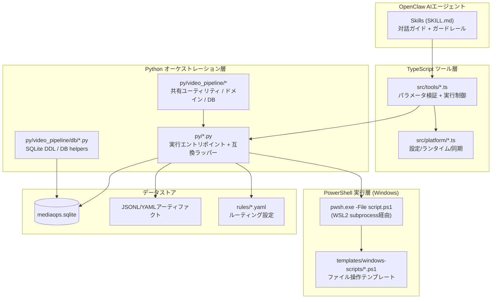

# ADR-0003: WSL2/Windowsファイル操作境界とPowerShell委譲

- Status: Accepted
- Date: 2026-04-23
- Source: README sections 2, 13 before ADR split

## Context

このプラグインはWSL2上のTypeScript/Pythonから、Windows側の録画ファイルを扱う。Windowsファイルシステム操作をWSL2 Pythonから直接行うと、長パス、Unicode正規化、9P経由のI/O不安定性が問題になる。

ファイル列挙、移動、ケース正規化などの物理操作はWindows側のネイティブAPIに近い実行環境で行う必要がある。

## Decision

Windowsファイル操作はWSL2 Pythonから直接実行せず、PowerShell 7テンプレートへ委譲する。

TypeScriptツール層は設定解決と実行制御を担当し、Python層はオーケストレーションとDB更新を担当する。物理ファイル操作はPowerShell実行層で行う。

## Layer Structure

## Rationale

PowerShellスクリプトが必要な理由は主に2点である。

1. 長パス制限を回避するため。`_long_path_utils.ps1` は全スクリプトからdot-sourceされる共通ライブラリで、`\\?\` プレフィックスを付与して `System.IO.File/Directory` の.NET APIを直接呼ぶ。
2. Unicode正規化によるパス不一致を避けるため。PowerShellの出力をPython側でNFKC正規化するとパス文字列のコードポイントが変わり、`src_not_found` エラーが発生することがある。`windows_pwsh_bridge.py` には出力テキストを正規化しない方針を明示する。

加えて、`windowsOpsRoot` 指定時はPowerShell primary scanによりWSL2 9P経由のスキャン不安定性を回避する。

## Script Deployment

スクリプトは起動時に `ensureWindowsScripts()` が `templates/windows-scripts/` を優先し、移行期間中のみ `assets/windows-scripts/` をフォールバックとして `windowsOpsRoot/scripts/` へ自動コピー・更新する。

| スクリプト | 用途 | 呼び出し元 |
|---|---|---|
| `_long_path_utils.ps1` | 共通ライブラリ。`\\?\` 長パス対応のFile/Directory操作関数群 | 全スクリプトからdot-source |
| `unwatched_inventory.ps1` | sourceRootのファイル列挙からJSONL出力。単一ルート、ハッシュ生成対応 | `unwatched_pipeline_runner.py` |
| `enumerate_files_jsonl.ps1` | 汎用ファイル列挙からJSONL出力。複数ルート、破損検出対応 | `pathscan_common.py` |
| `apply_move_plan.ps1` | 移動計画JSONLから物理ファイル移動。行ごとにok/errorを記録 | `unwatched_pipeline_runner.py`, `relocate_existing_files.py`, `dedup_recordings.py` |

## Prerequisites

| 要件 | 詳細 |
|---|---|
| OS | WSL2 (Windows 11) |
| PowerShell | 7.x (`pwsh` コマンドで利用可能) |
| Python | 3.10+ (`uv` でパッケージ管理) |
| Windows設定 | `LongPathsEnabled = 1` |
| 外部ツール | `czkawka-cli`。重複検出用OpenClawプラグイン |
| DB | SQLite 3 |

Python共有基盤として、`py/pathscan_common.py` がパス変換、path_id生成、JSONL読み込み、ファイルスキャンなどの横断ユーティリティを提供する。`py/mediaops_schema.py` はSQLiteスキーマDDLとDB接続ヘルパーを提供する。

## Consequences

- 物理ファイル操作のcanonical implementationは `templates/windows-scripts/` に置く。
- Python/TypeScript側はPowerShell出力を正規化しない。
- `assets/windows-scripts/` は移行期間中のフォールバックであり、新規実装の主配置先ではない。
- Windows側スクリプトのエラーは構造化JSONLでPython層へ返し、DB同期と監査ログで追跡する。
