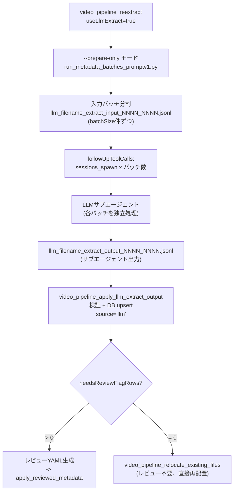

# ADR-0004: ツールオーケストレーションとfollowUpToolCalls

- Status: Accepted
- Date: 2026-04-23
- Source: README sections 6, 8 before ADR split

## Context

OpenClawのAIエージェントは、ユーザーの自然言語リクエストを複数ツールの実行に分解する。処理フローにはdry-run、レビュー、DB適用、再配置といった分岐があり、ツール呼び出し順をエージェントの暗黙知だけに依存させると事故が起きやすい。

ツール自身が「次に呼ぶべきツール」を返すことで、エージェントの自律実行を補助する必要がある。

## Decision

多くのツールは戻り値に `followUpToolCalls` 配列を含める。これは次に呼ぶべきツールとそのパラメータをツール自身が指示するチェーニング設計である。

対応ツールは以下とする。

- `relocate_existing_files`: dry-run後にapplyまたはprepare_relocate_metadataを指示する。
- `prepare_relocate_metadata`: reextract後にexport_program_yaml -> apply_reviewed_metadata -> relocate dry-runを指示する。
- `apply_llm_extract_output`: レビュー不要時はrelocateへ直接誘導する。
- `reextract` のLLMモード: sessions_spawn -> apply_llm_extract_outputを指示する。
- `export_program_yaml`: 生成YAMLパスを返す。

## Tool Details

### `video_pipeline_analyze_and_move_videos`

sourceRootのファイルを棚卸し、メタデータに基づきジャンル別ドライブへ移動する。

| パラメータ | 型 | 説明 |
|---|---|---|
| `apply` | boolean | `false`=dry-run、`true`=実行 |
| `maxFilesPerRun` | integer | 1回の処理上限。default: 200 |
| `allowNeedsReview` | boolean | `needs_review=true`のファイルも移動対象に含める。default: false |

内部で `unwatched_pipeline_runner.py` を実行し、`drive_routes.yaml` に基づくジャンルルーティングを適用する。

dry-run (`apply=false`) 時は inventory -> queue生成 -> rule-based `reextract` -> move plan まで一括で実行する。`reextract` 結果に `needs_review` 行が残った場合は、`llm/` 配下に `program_aliases_review_*.yaml` を自動生成し、結果JSONに `reviewYamlPath` / `reviewYamlPaths` / `reviewSummary` を含める。この分岐では `followUpToolCalls` は `video_pipeline_apply_reviewed_metadata` を案内し、追加の `reextract` 呼び出しは不要である。

### `video_pipeline_backfill_moved_files`

既存ライブラリのファイルをスキャンしDBに登録する。物理移動は行わない。

| パラメータ | 型 | 説明 |
|---|---|---|
| `apply` | boolean | `false`=dry-run、`true`=DB書き込み |
| `roots` | string[] | スキャン対象Windowsパス。省略時は `backfill_roots.yaml` |
| `extensions` | string[] | 対象拡張子。default: `[".mp4"]` |
| `limit` | integer | 処理上限ファイル数 |
| `includeObservations` | boolean | サイズ・mtime観測も記録。default: true |
| `queueMissingMetadata` | boolean | メタデータ未登録ファイルをreextractキューに追加 |
| `detectCorruption` | boolean | 先頭バイト読み取りによる破損検出。default: true |
| `scanErrorPolicy` | `warn` \| `fail` \| `threshold` | スキャンエラー時の挙動 |

### `video_pipeline_relocate_existing_files`

既存ライブラリのファイルをDBメタデータに基づき正しいフォルダに移動する。dry-run/applyの2段階実行とする。

| パラメータ | 型 | 説明 |
|---|---|---|
| `apply` | boolean | `false`=dry-run、`true`=物理移動実行 |
| `planPath` | string | apply時必須。dry-runが返す計画ファイルパス |
| `roots` | string[] | スキャン対象。省略時は `relocate_roots.yaml` |
| `allowNeedsReview` | boolean | `needs_review=true`のファイルも移動対象に含める。default: false |
| `allowUnreviewedMetadata` | boolean | `source` が `human_reviewed` / `llm` 以外でも計画生成を許可。default: false |
| `queueMissingMetadata` | boolean | メタデータ不足ファイルをキューに収集 |
| `writeMetadataQueueOnDryRun` | boolean | dry-run時もキューファイルを書き出す |
| `onDstExists` | `error` \| `rename_suffix` | 移動先に同名ファイルが存在する場合の挙動 |
| `skipSuspiciousTitleCheck` | boolean | suspiciousなtitle安全チェックを一時的に無効化。default: false |

安全機構は次の通り。

- apply時に `planPath` の存在確認と24時間以内の鮮度チェックを行う。
- apply前に自動DBバックアップとローテーションを行う。
- `followUpToolCalls` でRoute A、Route B、Route Cを分岐する。
- `source=llm` はsuspicious title安全チェックを通過した行のみ計画対象にする。失敗行は `needs_review=true` に自動更新して隔離する。

### `video_pipeline_prepare_relocate_metadata`

relocateフロー専用の複合オーケストレーター。内部で relocate dry-run、キュー生成、reextractを連続実行する。

| パラメータ | 型 | 説明 |
|---|---|---|
| `roots` / `rootsFilePath` | string[] / string | スキャン対象 |
| `runReextract` | boolean | reextractも実行するか。default: true |
| `batchSize` | integer | reextractバッチサイズ。default: 50 |
| `maxBatches` | integer | 最大バッチ数 |
| `preserveHumanReviewed` | boolean | human_reviewed済みレコードを保護。default: true |

成功時は `followUpToolCalls` で export_program_yaml -> apply_reviewed_metadata -> relocate dry-run の連鎖を指示する。

### `video_pipeline_reextract`

キューJSONLからメタデータを再抽出する。ルールベースエンジンとLLMサブエージェントの2モードを持つ。

| パラメータ | 型 | 説明 |
|---|---|---|
| `queuePath` | string | 入力キューJSONL。省略時はデフォルトキューを自動生成 |
| `useLlmExtract` | boolean | `true`=LLMサブエージェントモード。default: false |
| `llmModel` | string | LLMモデル指定。default: `claude-opus-4-6` |
| `batchSize` | integer | バッチサイズ。default: 50 |
| `maxBatches` | integer | 最大バッチ数 |
| `preserveHumanReviewed` | boolean | human_reviewed済みレコードを保護。default: true |

ルールベースモード (`useLlmExtract=false`) は `run_metadata_batches_promptv1.py` でファイル名パターンマッチングとEPGヒント照合を行い、`followUpToolCalls` で `export_program_yaml` を指示する。

LLMサブエージェントモード (`useLlmExtract=true`) は `--prepare-only` で入力バッチJSONLのみ生成し、`followUpToolCalls` で `sessions_spawn` -> `apply_llm_extract_output` の連鎖を指示する。

### `video_pipeline_apply_reviewed_metadata`

ヒューマンレビュー済みメタデータをDBに書き込む。YAMLを優先し、JSONLは互換導線として扱う。

| パラメータ | 型 | 説明 |
|---|---|---|
| `sourceYamlPath` | string | レビュー済みYAMLのパス。推奨 |
| `sourceJsonlPath` | string | レビュー済みJSONLのパス。互換導線 |
| `markHumanReviewed` | boolean | `human_reviewed=true` を付与。default: true |
| `allowNoContentChanges` | boolean | 内容未変更でも適用を許可。default: false |
| `source` | string | `path_metadata.source` に記録する値 |

apply前に自動DBバックアップとローテーションを行う。YAML適用時は、canonical titleが確認できていて `needs_review_reason` がタイトル系理由のみの場合、実際のretitleが発生しなくても `needs_review=false` へ自動復旧する。

### `video_pipeline_apply_llm_extract_output`

LLMが書き出した抽出結果JSONLを検証し、`source='llm'` でDBにupsertする。

| パラメータ | 型 | 説明 |
|---|---|---|
| `outputJsonlPath` | string | 必須。LLM抽出結果JSONLパス |
| `dryRun` | boolean | 検証のみ。default: false |

サブタイトル区切り文字の混入チェック、program_title長さ検証、型の強制変換を行う。問題のあるレコードは拒否ではなく `needs_review=true` として保全する。

分岐は次の通り。

- `needsReviewFlagRows > 0`: レビューYAMLを生成し、`apply_reviewed_metadata` へ誘導する。
- `needsReviewFlagRows = 0`: レビュー不要として、`relocate_existing_files` へ直接誘導する。

### `video_pipeline_dedup_recordings`

`czkawka_cli` のBLAKE3ハッシュスキャンとDBメタデータを組み合わせて重複録画を検出し、drop候補を隔離する。

| パラメータ | 型 | 説明 |
|---|---|---|
| `apply` | boolean | `false`=dry-run、`true`=隔離実行 |
| `maxGroups` | integer | 処理する重複グループ上限 |
| `confidenceThreshold` | number | 重複判定の信頼度閾値。default: 0.85 |
| `keepTerrestrialAndBscs` | boolean | 地上波・BS/CSを優先保持。default: true |
| `bucketRulesPath` | string | バケットルールYAML |

`dedup_recordings` は `czkawka-cli` プラグインの設定と出力フォルダを参照し、ツールは経由しない。これは、czkawkaスキャン、Python判定、PowerShell隔離の一連のパイプラインであり、途中にツール境界を置くとエラーハンドリングが複雑化するためである。

## LLM Subagent Flow

バッチ分割は次の通り。

- `reextract` は `--prepare-only` でキューJSONLを `batchSize` 件ずつの入力バッチに分割する。
- 各入力バッチに対応する出力ファイルパスを事前に決定する。`_input_` を `_output_` に置換する。
- `followUpToolCalls` にて `sessions_spawn` と `apply_llm_extract_output` を順に指示する。
- サブエージェントは入力JSONLの読み取り、メタデータ抽出、出力JSONL書き出し、`apply_llm_extract_output` 呼び出しを自律的に実行する。

## Simple Tool Reference

| ツール | 用途 | 主要パラメータ |
|---|---|---|
| `video_pipeline_validate` | 環境・設定チェック | `checkWindowsInterop`, `intent` |
| `video_pipeline_status` | パイプラインの最新状態サマリ | `includeRawPaths` |
| `video_pipeline_export_program_yaml` | 抽出結果からヒントYAML生成 | `sourceJsonlPath` |
| `video_pipeline_ingest_epg` | EDCB `.program.txt` からEPG番組情報を取り込み | - |
| `video_pipeline_detect_rebroadcasts` | 再放送グルーピング | - |
| `video_pipeline_dedup_rebroadcasts` | 同一番組+エピソードの再放送録画を検出し低優先度コピーを隔離 | `apply`, `maxGroups` |
| `video_pipeline_detect_folder_contamination` | フォルダ名へのサブタイトル混入を検出し修正候補を提案 | `programTitle`, `representativePathLike`, `canonicalTitle`, `programTitleContains` |
| `video_pipeline_update_program_titles` | 番組タイトルの一括修正 | `updates[]`, `dryRun` |
| `video_pipeline_normalize_folder_case` | フォルダ名の大文字小文字ケース正規化 | `apply`, `roots` |
| `video_pipeline_llm_extract_status` | LLM抽出バッチの完了状態確認・リトライ指示 | - |
| `video_pipeline_db_backup` / `db_restore` | DBスナップショットの作成・復元 | `action`, `descriptor`, `keep` |
| `video_pipeline_repair_db` | DB補修 | `action`, `dryRun`, `limit` |
| `video_pipeline_logs` | 監査ログ参照 | - |

## Consequences

- ツール結果が次の操作を返すため、AIエージェントは安全な標準フローを辿りやすくなる。
- ただし `followUpToolCalls` は自動承認ではない。ヒューマンレビューが必要な箇所ではレビューゲートを維持する。
- LLM抽出は直接確定データにはならない。`source=llm` として保存し、レビューまたはsuspicious titleチェックで安全性を補う。
