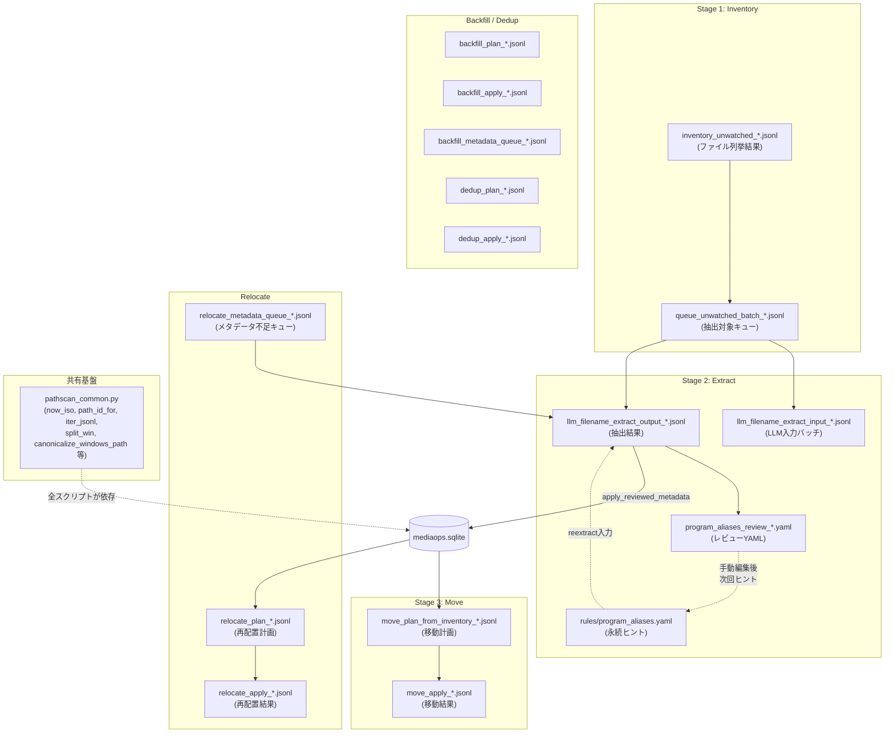
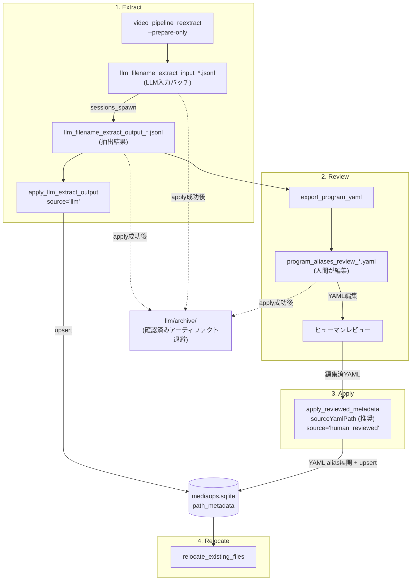
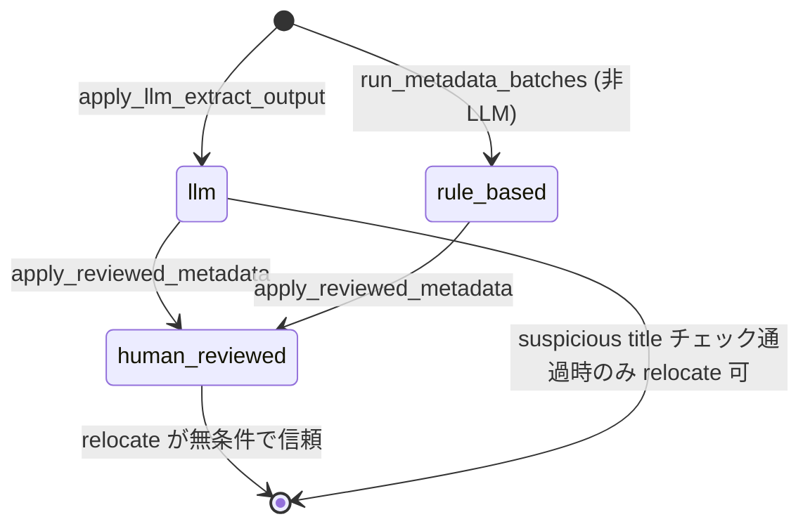

# ADR-0005: メタデータとアーティファクトライフサイクル

- Status: Accepted
- Date: 2026-04-23
- Source: README section 7 before ADR split

## Context

このプラグインはJSONL/YAMLファイルを中間アーティファクトとして使う。AIエージェント、Pythonスクリプト、PowerShellスクリプト、人間レビューが同じ処理に関わるため、どのファイルがどの段階で生成され、いつDBへ反映され、いつアーカイブされるかを明確にする必要がある。

## Decision

`windowsOpsRoot` 配下にDB、LLM入出力、移動計画、PowerShellスクリプト、隔離先を集約する。JSONL/YAMLは監査可能な中間成果物として扱い、DB反映済みのものはアーカイブする。

メタデータの信頼度は `path_metadata.source` で表す。

- `rule_based`: ルールベース抽出。
- `llm`: LLM抽出。推測データであり、relocate時にsuspicious titleチェックを必要とする。
- `human_reviewed`: ヒューマンレビュー済み確定データ。

## Data Flow



未視聴フロー (`video_pipeline_analyze_and_move_videos`) では、dry-run実行中に `QUEUE -> OUTPUT -> YAML` まで自動で進む。`reviewSummary.rowsNeedingReview > 0` の場合だけ `program_aliases_review_*.yaml` が生成され、生成パスはtool/scriptの戻り値から参照する。

## `windowsOpsRoot` Layout

設定値 `windowsOpsRoot` のデフォルトは `B:\_AI_WORK` である。配下に以下の構造を展開する。

```text
B:\_AI_WORK/
├── db/
│   ├── mediaops.sqlite
│   ├── mediaops.sqlite.bak_*
│   ├── tablacus_label.db
│   └── tablacus_label3.db
├── llm/
│   ├── llm_filename_extract_input_*.jsonl
│   ├── llm_filename_extract_output_*.jsonl
│   ├── program_aliases_review_*.yaml
│   ├── queue_unwatched_batch_*.jsonl
│   ├── relocate_metadata_queue_*.jsonl
│   ├── reviewed_metadata_*.yaml
│   └── archive/
├── move/
│   ├── inventory_unwatched_*.jsonl
│   ├── move_plan_from_inventory_*.jsonl
│   ├── move_apply_*.jsonl
│   ├── relocate_plan_*.jsonl
│   └── archive/
├── scripts/
│   ├── _long_path_utils.ps1
│   ├── unwatched_inventory.ps1
│   ├── apply_move_plan.ps1
│   └── enumerate_files_jsonl.ps1
├── duplicates/
│   └── quarantine/
├── quarantine/
├── inventory/
└── .gitignore
```

`archive/` ディレクトリは2系統あり、管理方法が異なる。

- `llm/archive/`: `apply_reviewed_metadata` のupsert成功後に、使用したYAML、抽出出力JSONL、対応する入力JSONLを非圧縮で自動アーカイブする。
- `move/archive/`: `rotate_move_audit_logs.py` が移動計画・結果JSONLをgzip圧縮してアーカイブする。

## Artifact Lifecycle



## Source State Transition



## Artifact Types

| アーティファクト | 生成ツール | 消費ツール | DB反映 | アーカイブ条件 |
|---|---|---|---|---|
| `llm_filename_extract_input_*.jsonl` | `reextract --prepare-only` | `sessions_spawn` | なし | 対応するoutputがDBに反映済み |
| `llm_filename_extract_output_*.jsonl` | LLMサブエージェント | `apply_llm_extract_output`, `export_program_yaml` | `apply_llm_extract_output` でupsert | `apply_reviewed_metadata` で上書き済み、またはneedsReview=0で直接relocate完了後 |
| `program_aliases_review_*.yaml` | `export_program_yaml` | `apply_reviewed_metadata` | YAMLエイリアス定義を展開してupsert | apply成功・DB反映確認後 |
| `*_reviewed_*.jsonl` | 人間がコピーして編集 | `apply_reviewed_metadata` | `apply_reviewed_metadata` でupsert | apply成功・DB反映確認後 |
| `reviewed_metadata_apply_*.jsonl` | `apply_reviewed_metadata` | なし | 一時ファイル | 原則残らない |

## Resolved Implementation Tasks

このライフサイクルに関する過去の実装タスクは完了済みである。

- [#40](https://github.com/NEXTAltair/video-library-pipeline/issues/40): relocateゲートを `needs_review` + `source` 併用方式に変更。
- [#41](https://github.com/NEXTAltair/video-library-pipeline/issues/41): `source=llm_subagent` を `llm` にリネーム。
- [#42](https://github.com/NEXTAltair/video-library-pipeline/issues/42): YAMLからDB反映するパスの実装とレビューワークフロー改善。
- [#43](https://github.com/NEXTAltair/video-library-pipeline/issues/43): DB反映確認後の自動アーカイブ再実装。
- [#44](https://github.com/NEXTAltair/video-library-pipeline/issues/44): EPG情報をメタデータ抽出のヒントとして活用。
- [#45](https://github.com/NEXTAltair/video-library-pipeline/issues/45): Stage名称・説明の見直しとドキュメント整理。

## Consequences

- JSONL/YAMLは単なる一時ファイルではなく、レビューと監査の単位として扱う。
- `llm/archive/` と `move/archive/` は役割と圧縮ポリシーが異なるため、同一視しない。
- source値の遷移を守ることで、LLM推測データと人間確定データを区別できる。
